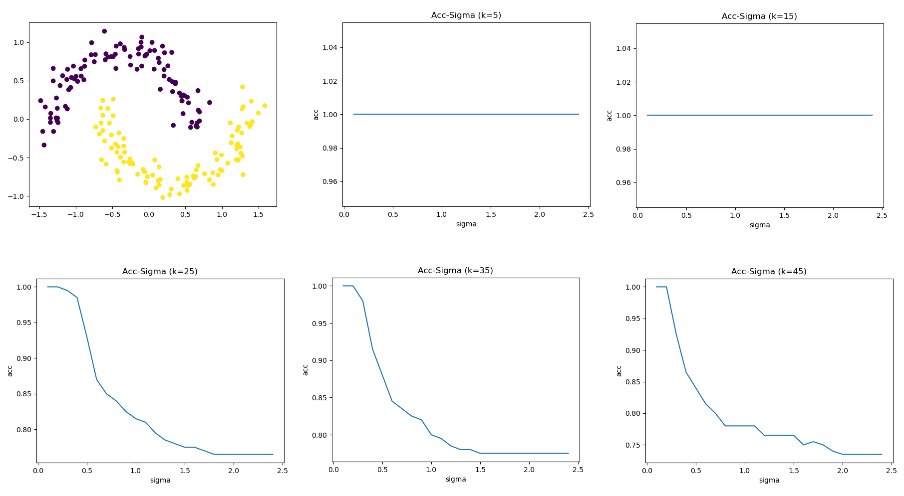

# 国科大模式识别作业

一天入坑LaTeX，仅作学习记录。:joy:

## 目录

- [hw1](#hw1)
- [hw2](#hw2)
- [hw3](#hw3)
- [hw4](#hw4)
- [hw5](#hw5)
- [hw6](#hw6)

## hw1

只有计算证明题目，没有实验。带拒识的最小风险决策，参数估计等。


## hw2

只有计算证明题目，没有实验。MAP，EM等。


## hw3


代码：

[./hw3/hw3.py](./hw3/hw3.py)

实验部分输出：

$\omega_1$ & $\omega_2$
```bash
Batch_perceptron algorithm：
a = [ 3.4  -3.04  3.41]
Iterations required for convergence is 24
```
$\omega_3$ & $\omega_2$
```bash
Batch_perceptron algorithm：
a = [ 1.9  -4.14  4.86]
Iterations required for convergence is 17
```
$\omega_1$ & $\omega_3$
```bash
Ho-Kashyap algorithm：
No solution found!
```
$\omega_2$ & $\omega_4$
```bash
Ho-Kashyap algorithm：
a = [[0.13381828]
 [0.03717747]
 [0.01669066]]
b = [[0.46787909]
 [0.01      ]
 [0.30111691]
 [0.3947414 ]
 [0.32167591]
 [0.13245664]
 [0.15628159]
 [0.12494896]
 [0.50786447]
 [0.24952647]
 [0.08073817]
 [0.19372309]
 [0.15084515]
 [0.23560033]
 [0.18203341]
 [0.03832449]
 [0.17504972]
 [0.29644592]
 [0.29204113]
 [0.26875263]]
Iterations required for convergence is 29132
```
MSE
```bash
MSE准则多分类：
target = [1. 1. 2. 2. 3. 3. 4. 4.]
output = [1. 1. 2. 2. 3. 3. 4. 4.]
accuracy = 1.0
```

## hw4


代码：

[./hw4/hw4.py](./hw4/hw4.py)

主体部分代码：

```py
    def tahn_func(self, s):
        return (np.exp(s) - np.exp(-s)) / (np.exp(s) + np.exp(-s))

    def sigmoid_func(self, s):
        return 1 / (1 + np.exp(-s))

    def forward(self, x_i):
        """
        Parameter:
            x_i: single sample
        Return:
            y_h: outputs of hidden-layer for single sample
            z_j: outputs of output-layer for single sample
        """
        # net_h = np.matmul(x_i.T, w_ih)
        net_h = x_i.T @ self.w_ih
        y_h = self.tahn_func(net_h)
        # net_j = np.matmul(y_h.T, w_hj)
        net_j = y_h.T @ self.w_hj
        z_j = self.sigmoid_func(net_j)
        return y_h, z_j

    def backward(self, z_j, y_h, x_i, t, eta):
        """
        Parameters:
            z_j: outputs of output-layer for single sample
            y_h: outputs of hidden-layer for single sample
            x_i: inputs of input-layer for single sample
            t: target's label
            eta: learn rate
        Return:
            Delta_w_hj: hidden-layer-output-layer weight updating matrix
            Delta_w_ih: input-layer-hidden-layer weight updating matrix
            error: sample square error for ploting
        """
        # reshape the dimension of matrix (3, 1) (n_h, 1) (3, 1) (3, 1)
        z_j = np.reshape(z_j, (z_j.shape[0], 1))
        y_h = np.reshape(y_h, (y_h.shape[0], 1))
        x_i = np.reshape(x_i, (x_i.shape[0], 1))
        t = np.reshape(t, (t.shape[0], 1))
        # The following matrixs' shape: (1, 1)(3, 1)(n_h, 3)(n_h, 1)(3, n_h)
        # output error
        error = ((t - z_j).T @ (t - z_j))[0][0]
        # sigmoid'(s) = sigmoid(s) * (1-sigmoid(s)) = z_j * (1-z_j)
        delta_j = (t - z_j) * z_j * (1-z_j)
        Delta_w_hj = eta * (y_h @ delta_j.T)
        # tanh'(s) = 1-tanh(s)^2 = 1-y_h**2
        delta_h = (((t - z_j) * z_j * (1-z_j)).T @ self.w_hj.T).T * (1-y_h**2)
        Delta_w_ih = eta * (x_i @ delta_h.T)
        return Delta_w_hj, Delta_w_ih, error

    def train(self, bk_type, eta, epoch_num):
        """
        Parameters:
            bk_type: 'single' or 'batch'
            eta: learn rate
            epoch_num: maximum iretation number
        Return:
            w_ih:input-layer-hidden-layer weight finally matrix
            w_hj:hidden-layer-output-layer weight finally matrix
        """
        # Stochastic Backpropagation
        if bk_type == 'single':
            E = []
            for _ in range(epoch_num):
                e = []
                for idx, x_i in enumerate(self.train_data):
                    # forward
                    y_h, z_j = self.forward(x_i)
                    # backward
                    Delta_w_hj, Delta_w_ih, error = self.backward(
                        z_j, y_h, x_i, self.train_label[idx], eta)
                    # weight update each sample
                    self.w_hj += Delta_w_hj
                    self.w_ih += Delta_w_ih
                    e.append(error)
                E.append(np.mean(e))

        # Batch Backpropagation
        if bk_type == 'batch':
            E = []
            for _ in range(epoch_num):
                e = []
                Batch_Delta_w_hj = 0
                Batch_Delta_w_ih = 0
                for idx, x_i in enumerate(self.train_data):
                    # forward
                    y_h, z_j = self.forward(x_i)
                    # backward
                    Delta_w_hj, Delta_w_ih, error = self.backward(
                        z_j, y_h, x_i, self.train_label[idx], eta)
                    # template weight matrix update each sample
                    Batch_Delta_w_hj += Delta_w_hj
                    Batch_Delta_w_ih += Delta_w_ih
                    e.append(error)
                # weight matrix update each iretation
                self.w_hj += Batch_Delta_w_hj
                self.w_ih += Batch_Delta_w_ih
                E.append(np.mean(e))

        # OUTPUT
        print('w_ih: ', self.w_ih)
        print('w_hj: ', self.w_hj)
        print('Error of each iretation: ', E)
        plt.plot(E, label="#OfNodes:{} LearnRate:{} #OfIretation:{}".format(
            self.n_h, eta, epoch_num))
```

实验部分输出：

隐含层结点数目 $n_h$ 变化对 Error 影响对比图


学习率 $\eta$ 变化对 Error 影响对比图


## hw5


200个样本点见[./hw5/data.txt](./hw5/data.txt)

代码1：

[./hw5/hw_5_kmeans.py](./hw5/hw_5_kmeans.py)

核心部分：

```py
def k_means(data, mu_init):
    """
    Parameters:
        data: data to be clustered (n*d)
        mu_init: initialized means (c*d)
    Return:
        res: cluster result like [[datas in class 0], ... , [datas in class c-1]] (c*about200*d)
        label: every data's label like [0,2,1,..,0,1] (n*1)
        mu: finally mean like [[center of class 0], ... , [center in class c-1]] (c*d)
        cnt: the times of iretation
    """
    mu_old = np.zeros_like(mu_init)
    mu = mu_init
    cnt = 0
    c = len(mu_init)
    n, d = data.shape
    distance = np.zeros((n, c), dtype=np.float64)
    label = np.zeros(len(data))

    while np.sum(mu - mu_old):
        mu_old = mu
        cnt += 1
        # compute distance matrix (n*c)
        for i in range(n):
            for j in range(c):
                distance[i][j] = np.linalg.norm(data[i] - mu[j])
        # compute res(c*about200*d) & label(n*1)
        res = []
        for _ in range(c):
            res.append([])
        for idx, sample in enumerate(data):
            label[idx] = np.argmin(distance[idx])
            res[np.argmin(distance[idx])].append(sample)
        res = np.array(res)
        # recompute class center mu
        mu = []
        for i in res:
            mu.append(np.mean(i, axis=0))
        mu = np.array(mu)
        # print(mu, mu.shape)

    return res, label, mu, cnt
```

效果图1：


代码2：

[./hw5/hw5_spectral_cluster.py](./hw5/hw5_spectral_cluster.py)

核心部分：

```py
def generate_graph(data, k, sigma):
    """
    Parameter:
        data: data to be clustered
        k: number of neighbor
        sigma: parameter of weight in samilarity matrix
    Return:
        W: degree Matrix
    """
    m, n = data.shape
    dist = np.zeros((m, m), dtype=np.float64)
    W = np.zeros((m, m), dtype=np.float64)
    for i in range(m):
        for j in range(m):
            dist[i, j] = np.linalg.norm(data[i] - data[j]) ** 2
    # xi's k nearest neighbours
    for i in range(m):
        dist_with_index = zip(dist[i], range(m))
        dist_with_index = sorted(dist_with_index, key=lambda x: x[0])
        neighbours_id = [dist_with_index[j][1] for j in range(k+1)]
        for j in neighbours_id:
            if i != j:
                W[i, j] = np.exp(-dist[i, j] / (2 * sigma ** 2))
    W = (W.T + W)/2
    # print(W)
    return W


def Ng_algorithm(W, c):
    """
    Parameter:
        W: degree Matrix
        c: number of classes
    Return:
        label: every data's label like [0,1,1,..,0,1] (n*1)
    """
    # 1.Degree Matrix: D=diag(sum(W))
    W_row_sum = np.sum(W, axis=1)
    D = np.diag(W_row_sum)
    # 2.Laplacian Matrix: L=D-W
    L = D - W
    # 3.normailzed matrix L_sym=D^(-1/2) L D^(-1/2)
    sqrt_D = np.diag(W_row_sum ** (-0.5))
    L_sym = sqrt_D.dot(L).dot(sqrt_D)
    # 4.eigen decomposition
    e_value, e_vector = np.linalg.eig(L_sym)
    e_vector = e_vector.T
    e = zip(e_value, e_vector)
    e_sorted = sorted(e, key=lambda e: e[0])
    # 5.get top-min-eigen-value c vectors
    U = []
    for i in range(c):
        U.append(e_sorted[i][1])
    U = np.array(U).T
    # 6.noemalize new feature
    T = []
    for val in U:
        val = val / np.linalg.norm(U, axis=0)
        T.append(val)
    T = np.array(T)
    # 7.kmeans
    kmeans = KMeans(n_clusters=2)
    label = kmeans.fit_predict(T)
    return label
```

效果图2：



先用MATLAB实现了一下，但是效果不太好，应该是当时刚学完理解不太到位。[./hw5/PR_hw5_1.m](./hw5/PR_hw5_1.m), [./hw5/K_Means.m](./hw5/K_Means.m)

## hw6


代码：

[./hw6/hw_6.py](./hw6/hw_6.py)

核心部分：

```py
    # 1.Get data
    classes = [0, 2]
    train_images, train_labels, test_images, test_labels, train_images_temp1 = data_load(
        cls=classes)
    print('Train images number: {}\nTest images number: {}'.format(
        len(train_labels), len(test_labels)))

    # 2.Verify label & image
    for i in range(10):
        print(train_labels[5918 + i])
        plt.subplot(2, 5, i+1)
        plt.imshow(train_images_temp1[5918+i], cmap='gray')
        plt.xticks([])
        plt.yticks([])
    plt.show()
    print('done')

    # 3.SVM with different c & gamma
    Cs = [0.001, 0.1, 1, 1e6]
    gammas = [1/80, 1/800, 1/800000, 0]
    for C in Cs:
        Acc1 = []
        Acc2 = []
        for gamma in gammas:
            print('C = %f, gamma = %f' % (C, gamma))
            # 3.1.New a SVM predictor
            if gamma == 0:
                predictor = svm.SVC(gamma='auto', C=C,
                                    kernel='linear', max_iter=100)
            else:
                predictor = svm.SVC(
                    gamma=gamma, C=C, kernel='rbf', max_iter=100)
            # 3.2.Train SVM model
            predictor.fit(train_images, np.int8(train_labels))
            # 3.3.Get accuracy of trainset & testset
            result1 = predictor.score(train_images, train_labels)
            print('The accuracy of trainset is %f' % result1)
            result2 = predictor.score(test_images, test_labels)
            print('the accuracy of testset is %f' % result2)
            Acc1.append(round(result1, 4))
            Acc2.append(round(result2, 4))
        # 3.4.plot Acc-Gammas with different C
        # plt.semilogx(gammas, Acc1)
        plt.plot(gammas, Acc1)
        for a, b in zip(gammas, Acc1):
            plt.text(a, b, (a, b), ha='center', va='bottom')
        # plt.semilogx(gammas, Acc2)
        plt.plot(gammas, Acc2)
        for a, b in zip(gammas, Acc2):
            plt.text(a, b, (a, b), ha='center', va='bottom')
        plt.legend(['Train Acc', 'Test Acc'])
        plt.title("Acc-Gammas (C={})".format(C))
        plt.xlabel("gamma")
        plt.ylabel("acc")
        plt.show()
```

验证所取得的数字图片对不对：


准确度对比：


<details>
<summary>输出如下：</summary>

```bash
magic_number: 2051, image_number: 60000, image_size: 28*28
Number of parsed images: 60000
magic_number: 2049, image_number: 60000
Number of parsed labels: 60000
magic_number: 2051, image_number: 10000, image_size: 28*28
Number of parsed images: 10000
magic_number: 2049, image_number: 10000
Number of parsed labels: 10000
(60000, 28, 28)
Train images number: 11881
Test images number: 2012

C = 0.001000, gamma = 0.012500
The accuracy of trainset is 0.972309
the accuracy of testset is 0.975149
C = 0.001000, gamma = 0.001250
The accuracy of trainset is 0.909519
the accuracy of testset is 0.902087
C = 0.001000, gamma = 0.000001
The accuracy of trainset is 0.876526
the accuracy of testset is 0.871272
C = 0.001000, gamma = 0.000000
The accuracy of trainset is 0.907920
the accuracy of testset is 0.903579

C = 0.100000, gamma = 0.012500
The accuracy of trainset is 0.987122
the accuracy of testset is 0.985586
C = 0.100000, gamma = 0.001250
The accuracy of trainset is 0.928205
the accuracy of testset is 0.927435
C = 0.100000, gamma = 0.000001
The accuracy of trainset is 0.876526
the accuracy of testset is 0.871272
C = 0.100000, gamma = 0.000000
The accuracy of trainset is 0.965154
the accuracy of testset is 0.970676

C = 1.000000, gamma = 0.012500
The accuracy of trainset is 0.999663
the accuracy of testset is 0.996024
C = 1.000000, gamma = 0.001250
The accuracy of trainset is 0.928373
the accuracy of testset is 0.927932
C = 1.000000, gamma = 0.000001
The accuracy of trainset is 0.876526
the accuracy of testset is 0.871272
C = 1.000000, gamma = 0.000000
The accuracy of trainset is 0.938389
the accuracy of testset is 0.939364

C = 1000000.000000, gamma = 0.012500
The accuracy of trainset is 1.000000
the accuracy of testset is 0.994036
C = 1000000.000000, gamma = 0.001250
The accuracy of trainset is 0.964986
the accuracy of testset is 0.962227
C = 1000000.000000, gamma = 0.000001
The accuracy of trainset is 0.945964
the accuracy of testset is 0.947316
C = 1000000.000000, gamma = 0.000000
The accuracy of trainset is 0.938389
the accuracy of testset is 0.939364
```
</details>

其实SVM部分代码并不多，只是加载 `idx3-ubyte` 和 `idx1-ubyte` 数据代码稍复杂。由图可知：C 过小，欠拟合，准确度较小；C 过大，过拟合，Test 和 Train 的准确率相差会变大。gamma 过小准确度较小，gamma 越大准确度相对变大。

后来画了热力图感觉挺好看的，分析也很直观：

